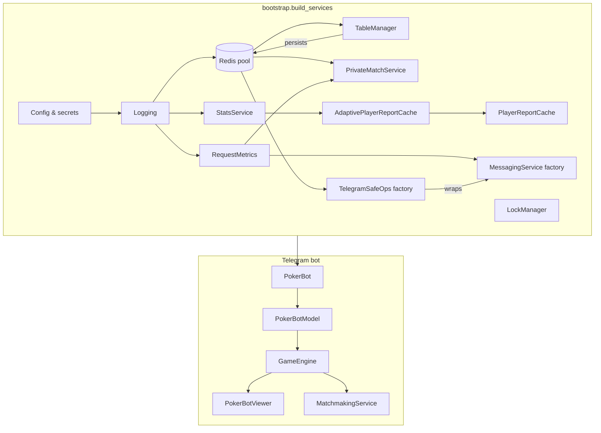
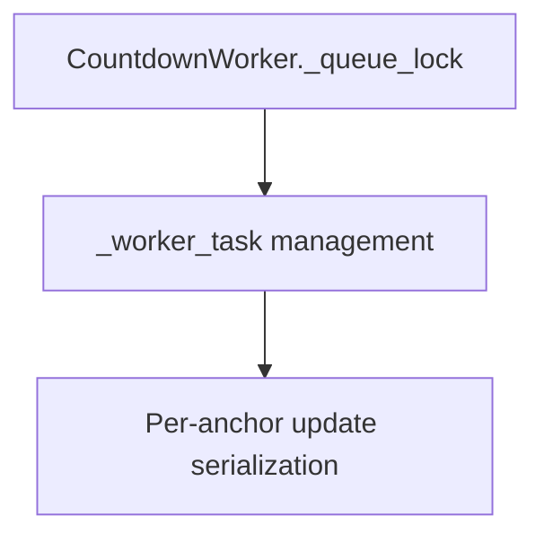
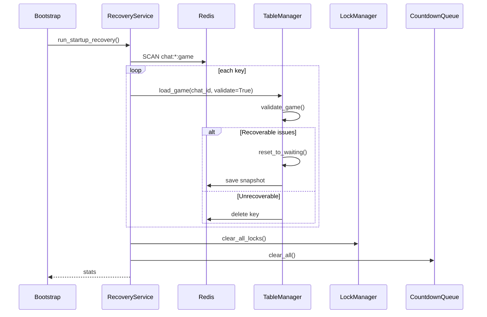

# Architecture Overview

This document describes how the Telegram bot is wired together at runtime. The
composition root lives inside [`pokerapp/bootstrap.py`](../pokerapp/bootstrap.py)
and builds the long-lived services that the bot reuses for every chat. Those
services are injected into the game model, engine, and viewers so that gameplay
logic never relies on global singletons.

## Composition root



*Bootstrap* is the only module that touches raw configuration, network clients,
or logging setup. Everything else is passed in as constructor arguments, which
makes the poker logic easy to test and reason about.

## Core services

| Service | Responsibility |
| ------- | -------------- |
| **TableManager** | Persists `Game` snapshots in Redis, rehydrates games after bot restarts, and enforces per-chat storage isolation. |
| **StatsService / StatsReporter** | Streams `hand_started` and `hand_finished_deferred` events into the relational database or a no-op backend, depending on configuration. |
| **PlayerReportCache** | Provides cached leaderboard and player statistics for `/stats` requests so users see instant responses. |
| **AdaptivePlayerReportCache** | Learns which players query stats most often and invalidates their cache entries immediately after each hand or stop vote. |
| **PrivateMatchService** | Manages private matches, old-player reminders, and other orchestration that spans multiple hands. |
| **MessagingService** | Encapsulates Telegram throttling, retries, and Markdown formatting. Instances are created through a factory stored in `ApplicationServices`. |
| **TelegramSafeOps** | Wraps `MessagingService` calls with logging metadata, context-aware rate limiting, and exception handling so background tasks remain resilient. |

## Distributed Action Lock System

### Overview
The action lock system prevents race conditions when multiple players interact with the same game state simultaneously. It uses Redis for distributed coordination across multiple bot instances.

### Backend Selection
- **Redis Mode**: When `redis_pool` is provided, uses Redis `SET NX EX` for atomic distributed locks
- **In-Memory Mode**: Fallback for single-instance deployments without Redis

### Lock Lifecycle
1. **Acquisition**: `SET action:{chat_id}:{user_id}:{action} {token} NX EX {ttl}`
2. **Processing**: Handler executes game logic while lock is held
3. **Release**: Lua script validates token ownership before deletion
4. **Auto-Expiry**: Redis TTL ensures locks don't leak on crashes

### Observability
- **Metrics**: Purge count, peak size, current size (in-memory backend)
- **Logging**: Structured logs with event types for query/aggregation
- **Backend Version**: Tracked for debugging compatibility issues

### Configuration
```json
{
  "engine": {
    "action_lock_prefix": "action:lock:"
  }
}
```

### Testing
- Unit tests with FakeRedis for Redis mode
- Concurrency stress tests (12+ simultaneous locks)
- Fallback tests for connection failures

## Runtime Resilience (Task 6.1)

### Telegram API Retry Logic
All Telegram API interactions now flow through a dedicated `TelegramRetryManager` that applies exponential backoff and rate-limit handling around bot calls.

- **Exponential Backoff** — network errors (timeouts, transient disconnects) trigger retries with doubling delays up to a configured ceiling.
- **Rate Limit Compliance** — `RetryAfter` responses are honoured by sleeping for `retry_after + 1` seconds before reattempting the call.
- **Critical vs Non-Critical** — dealer announcements, pot updates, and hole card delivery retry twice as many times as routine edits and clean-up calls.
- **Graceful Degradation** — non-critical operations return `None` after exhausting retries while critical operations bubble the original exception for upstream handling.

Example log flow:

```
WARNING Telegram edit_message_text failed, retrying in 2.0s attempt=1 error=NetworkError
INFO Telegram edit_message_text succeeded after retry attempt=2
```

### Redis Optimistic Locking
Game persistence uses optimistic locking to avoid lost updates when multiple tasks modify the same chat concurrently.

- **Version Counter** — each chat stores `game:{chat_id}:version` alongside the serialized game snapshot.
- **WATCH/MULTI/EXEC** — saves only commit when the version observed during load matches the version in Redis, then increments the counter atomically.
- **Conflict Detection** — mismatched versions or Redis `WatchError`s return `False` so callers can reload and retry with fresh state.
- **Backward Compatible** — existing `load_game` / `save_game` helpers remain available while new workflows can opt into version-aware variants.

Example usage:

```python
game, version = await table_manager.load_game_with_version(chat_id)
game.pot += bet_amount
success = await table_manager.save_game_with_version_check(chat_id, game, version)
if not success:
    # Reload and retry with the latest snapshot
    game, version = await table_manager.load_game_with_version(chat_id)
```

#### Countdown Error Handling

| Error Type | Detection | Response | Queue Cleanup |
| ---------- | --------- | -------- | ------------- |
| Message deleted | "message to edit not found" in `TelegramBadRequest` | Log warning, remove anchor from queue | Yes (via `_remove_anchor_updates()`) |
| Message uneditable | "message can't be edited" in `TelegramBadRequest` | Log warning, remove anchor from queue | Yes |
| Content unchanged | "message is not modified" in `TelegramBadRequest` | Log debug, update timestamp, continue | No |
| Other BadRequest | Any other `TelegramBadRequest` | Log error, abort countdown | No |
| API error | `TelegramAPIError` | Log exception, abort countdown | No |

The `_remove_anchor_updates()` helper ensures that when an anchor is deleted (by user action or Telegram cleanup), all pending countdown messages for that anchor are removed from the queue, preventing infinite retry loops.

The `cancel_updates_for_anchor()` method is idempotent: it silently succeeds even if the anchor doesn’t exist, making it safe to call during cleanup without checking existence first.

All of these services are created once by the bootstrapper and either stored
inside `ApplicationServices` or exposed via factories for per-chat usage.

## GameEngine dependencies

`GameEngine` receives its collaborators through dependency injection. The main
constructor arguments are:

- `TableManager` — source of truth for persisted `Game` objects.
- `PokerBotViewer` — renders keyboards and status messages to Telegram.
- `MatchmakingService` — drives stage transitions (`start_game`, `progress_stage`,
  and dealing helpers) while holding the `LockManager` stage lock.
- `PlayerManager` — manages seating, ready prompts, and stop votes.
- `StatsReporter` — records `hand_started`/`hand_finished_deferred` events and invalidates
  caches for player reports.
- `RequestMetrics` — tracks per-stage timing and request categories for logging.
- `TelegramSafeOps` — ensures Telegram API calls are retried safely with rich
  logging metadata.
- `AdaptivePlayerReportCache` — keeps frequently requested statistics fresh.
- `LockManager` — coordinates stage/table/player locks so concurrent callbacks do
  not corrupt game state.

The combination of a single composition root and constructor injection keeps the
bot modular: new services can be swapped in (for example a different cache or
messaging backend) without editing the poker logic itself.

## Countdown concurrency guarantees

The pre-start countdown subsystem coordinates asynchronous Telegram edits through
a centralized worker queue.  The key invariants are:

- **Single writer per chat:** `start_prestart_countdown` schedules updates through
  `CountdownWorker.schedule_message_update`, which enqueues them in a centralized
  priority queue.  The worker processes updates serially, ensuring only one edit
  per `(chat_id, message_id)` is in flight at a time.  Cancellation via
  `cancel_prestart_countdown` immediately removes pending updates from the queue.
- **Rate-limited updates:** `schedule_message_update` funnels edits through a
  debounced worker (`_execute_debounced_update`) so multiple countdown ticks
  coalesce into a single Telegram edit.  The debounce window enforces Telegram's
  `1 req/sec` guidance without dropping the final state.
- **Monotonic timing:** Countdown math relies on `loop.time()` (monotonic) rather
  than wall clock time, keeping the remaining seconds stable even if the host's
  clock jumps forward or backward.

Together these guarantees eliminate the "time travel" countdown bug, ensure that
rapid start/stop sequences settle cleanly, and shield the bot from 429 rate-limit
errors when high volumes of edits are scheduled simultaneously.

### Lock hierarchy

The countdown subsystem uses minimal locking to coordinate concurrent updates:



`CountdownWorker._queue_lock` protects the internal priority queue during
`schedule_message_update` and `cancel_updates_for_anchor`.  The worker processes
updates serially, so no per-anchor locks are needed.  Cancellation is immediate:
pending updates are removed from the queue without waiting for task acknowledgment.

## Game State Recovery

Recovering from Redis restarts or application crashes relies on a dedicated
validation and cleanup pipeline:

- **Validation** — `GameStateValidator.validate_game` inspects each persisted
  `Game` and emits `ValidationIssue` flags when the snapshot is inconsistent.
  The validator checks for `INVALID_STAGE`, `ORPHANED_PLAYERS`,
  `MISSING_DEALER`, `INCONSISTENT_POT`, `INVALID_DECK`, and `CORRUPTED_JSON`.
- **Recovery** — `GameStateValidator.recover_game` decides whether the game can
  be repaired in place (`reset_to_waiting`) or must be recreated from scratch
  (`delete_and_recreate`).  Recoverable games keep their seated players but reset
  blinds, bets, and community cards.
- **Startup sweep** — `RecoveryService.run_startup_recovery` scans Redis for
  `chat:*:game` keys, loads each snapshot through `TableManager.load_game`, and
  applies the validator.  The service also clears any cached locks and countdown
  tasks to prevent orphaned state from blocking new commands.



### Error handling

- **Graceful JSON errors:** `TableManager.load_game` catches decoding failures
  (pickle or JSON) and deletes the corrupted key instead of raising.
- **Structured logging:** Every recovery step logs its outcome with structured
  `extra` payloads so dashboards can track `games_deleted`, `games_recovered`,
  `locks_cleared`, and `countdowns_cleared` metrics.
- **Resilient iteration:** `RecoveryService` wraps each Redis key and cleanup
  phase in `try/except`, logging failures while continuing with the remaining
  work to avoid partial startup states.
