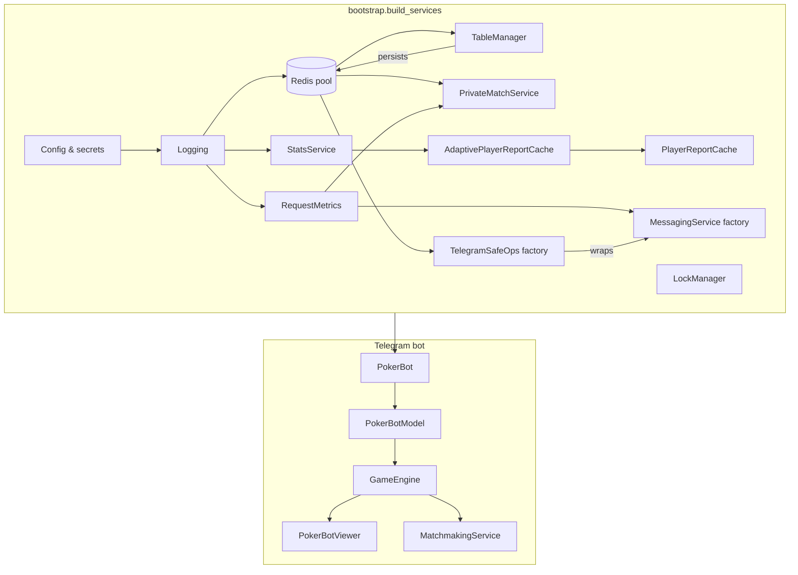

# Architecture Overview

This document describes how the Telegram bot is wired together at runtime. The
composition root lives inside [`pokerapp/bootstrap.py`](../pokerapp/bootstrap.py)
and builds the long-lived services that the bot reuses for every chat. Those
services are injected into the game model, engine, and viewers so that gameplay
logic never relies on global singletons.

## Composition root

*Bootstrap* is the only module that touches raw configuration, network clients,
or logging setup. Everything else is passed in as constructor arguments, which
makes the poker logic easy to test and reason about.

## Core services

| Service | Responsibility |
| ------- | -------------- |
| **TableManager** | Persists `Game` snapshots in Redis, rehydrates games after bot restarts, and enforces per-chat storage isolation. |
| **StatsService / StatsReporter** | Streams `hand_started` and `hand_finished` events into the relational database or a no-op backend, depending on configuration. |
| **PlayerReportCache** | Provides cached leaderboard and player statistics for `/stats` requests so users see instant responses. |
| **AdaptivePlayerReportCache** | Learns which players query stats most often and invalidates their cache entries immediately after each hand or stop vote. |
| **PrivateMatchService** | Manages private matches, old-player reminders, and other orchestration that spans multiple hands. |
| **MessagingService** | Encapsulates Telegram throttling, retries, and Markdown formatting. Instances are created through a factory stored in `ApplicationServices`. |
| **TelegramSafeOps** | Wraps `MessagingService` calls with logging metadata, context-aware rate limiting, and exception handling so background tasks remain resilient. |

All of these services are created once by the bootstrapper and either stored
inside `ApplicationServices` or exposed via factories for per-chat usage.

## GameEngine dependencies

`GameEngine` receives its collaborators through dependency injection. The main
constructor arguments are:

- `TableManager` — source of truth for persisted `Game` objects.
- `PokerBotViewer` — renders keyboards and status messages to Telegram.
- `MatchmakingService` — drives stage transitions (`start_game`, `progress_stage`,
  and dealing helpers) while holding the `LockManager` stage lock.
- `PlayerManager` — manages seating, ready prompts, and stop votes.
- `StatsReporter` — records `hand_started`/`hand_finished` events and invalidates
  caches for player reports.
- `RequestMetrics` — tracks per-stage timing and request categories for logging.
- `TelegramSafeOps` — ensures Telegram API calls are retried safely with rich
  logging metadata.
- `AdaptivePlayerReportCache` — keeps frequently requested statistics fresh.
- `LockManager` — coordinates stage/table/player locks so concurrent callbacks do
  not corrupt game state.

The combination of a single composition root and constructor injection keeps the
bot modular: new services can be swapped in (for example a different cache or
messaging backend) without editing the poker logic itself.
