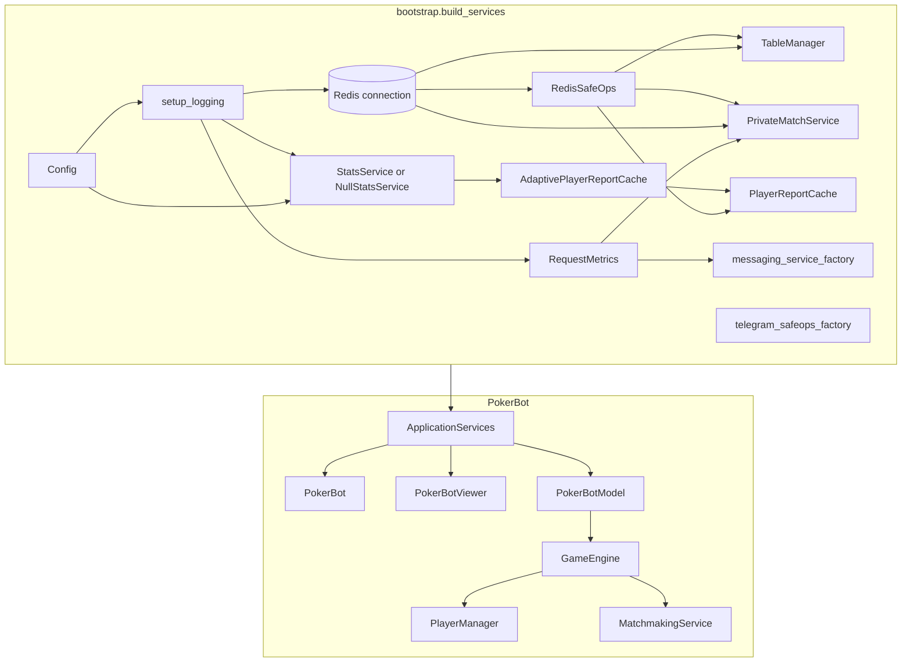
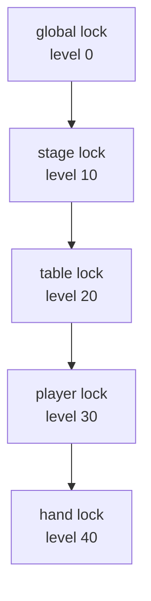

# Architecture & Dependency Injection

This guide summarises how the Telegram bot is composed at runtime, which
infrastructure services are shared across components, and how locking is used to
keep concurrent updates consistent.

The authoritative implementation lives in
[`pokerapp/bootstrap.py`](../pokerapp/bootstrap.py). It exposes a single
`build_services(cfg)` entry point that constructs an `ApplicationServices`
dataclass with everything required by [`pokerapp/pokerbot.py`](../pokerapp/pokerbot.py).

## Dependency injection overview

Bootstrap reads configuration, sets up logging, and instantiates infrastructure
clients once. Those singletons are then threaded through factories so higher
layers never reach out to global state. The Mermaid graph below is generated
from the relationships encoded inside `bootstrap.build_services`, making it a
developer-friendly snapshot of how runtime wiring flows from configuration into
the bot, model, and engine layers.



The Mermaid source for this dependency-injection diagram is located at
[`docs/diagrams/architecture_di_overview.mmd`](diagrams/architecture_di_overview.mmd).

`ApplicationServices` keeps factories lightweight: the `MessagingService` and
`TelegramSafeOps` instances are created per Telegram `Application` and receive
shared metrics/logging dependencies automatically.

## Component responsibilities & data flow

```mermaid
flowchart LR
    subgraph Telegram Layer
        TG[Telegram API]
        VIEW[PokerBotViewer]
    end

    subgraph Game Layer
        MODEL[PokerBotModel]
        ENGINE[GameEngine]
        PM[PlayerManager]
        MATCH[MatchmakingService]
        TABLE[TableManager]
        STATS[StatsReporter/StatsService]
        METRIC[RequestMetrics]
    end

    subgraph Persistence
        REDIS[(Redis)]
        DB[(Database)]
    end

    TG <--> VIEW
    VIEW --> MODEL : callbacks / updates
    MODEL --> ENGINE : start_game, progress_stage, finalize_game
    ENGINE --> MATCH : orchestration
    MATCH --> TABLE : save_game
    ENGINE --> TABLE
    TABLE --> REDIS
    ENGINE --> PM : seat/role updates
    PM --> VIEW : join prompt & anchors
    ENGINE --> VIEW : table snapshots
    ENGINE --> STATS : hand_started / hand_finished
    STATS --> DB
    ENGINE --> METRIC : cycle tracking
    METRIC --> REDIS : counters
```

You can regenerate the component data-flow diagram from
[`docs/diagrams/architecture_data_flow.mmd`](diagrams/architecture_data_flow.mmd).

Key takeaways:

- **PokerBot** (not shown) keeps only Telegram wiring; all poker logic lives in
  `PokerBotModel` and `GameEngine` with collaborators injected at construction.
- **MatchmakingService** encapsulates the stage transitions and blind handling,
  leaving `GameEngine` to focus on higher-level orchestration and finalisation.
- **TableManager** is the single source of truth for `Game` objects, persisting
  snapshots to Redis and rehydrating wallets when necessary.
- **StatsService** may be a no-op (`NullStatsService`) or a fully backed SQL
  implementation; the interface is stable so the rest of the engine does not
  change.
- **MessagingService** hides Telegram retry policies and deduplication; it is
  created through the factory stored in `ApplicationServices` so each `Bot`
  instance is isolated while still sharing metrics counters.

## Lock hierarchy

`LockManager` defines acquisition levels to guard against deadlocks. Locks must
always be taken from lowest numeric level to highest. If a coroutine already
holds a high-level lock, it cannot attempt to take a lower-level one.



The lock diagram is synchronised with
[`docs/diagrams/lock_hierarchy.mmd`](diagrams/lock_hierarchy.mmd).

## Stats & reporting collaboration

`StatsService` owns the database connection pool and orchestrates background
aggregation tasks. When `bootstrap.build_services` is invoked the service either
constructs a concrete implementation (for production) or a `NullStatsService`
stub. Regardless of the concrete type it wires two helper caches:

- **`AdaptivePlayerReportCache`** tracks the most recent statistics snapshot per
  player and invalidates entries when hands finish. It trades memory for a
  responsive `/stats` command even in chats with limited Redis throughput.
- **`PlayerReportCache`** stores rendered, localised report payloads so the bot
  can respond immediately to repeated requests within the cache TTL.

`StatsService` publishes both caches via the shared `ApplicationServices`
dataclass. `PokerBotModel` consumes the high-level interface, while
`GameEngine.finalize_game` emits `hand_finished` events with raw payout data.
`AdaptivePlayerReportCache` listens to those events to expire affected player
entries, ensuring the next `/stats` call picks up the fresh totals without
manual cache busting.

Practical guidelines:

1. **Stage locks** (e.g. `GameEngine._stage_lock_key`) wrap state transitions so
   Telegram callbacks cannot mutate the same chat simultaneously.
2. **Table locks** are used by `TableManager` to serialise persistence for a
   given chat when multiple operations are inflight.
3. **Player locks** guard wallet mutations and bankroll operations.
4. **Hand locks** are reserved for expensive winner-determination or stats
   processing that needs exclusive access to the `Game` model.

When introducing new locks choose a level equal to or higher than the resource
it protects. This keeps lock acquisition order predictable and makes the
observability inside `LockManager`'s structured logging meaningful.
