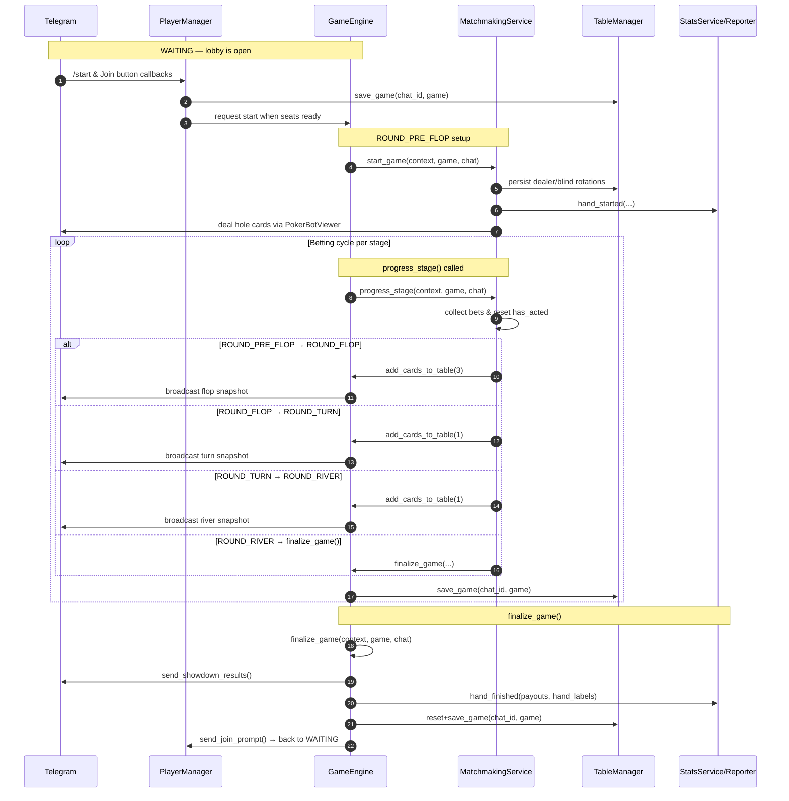
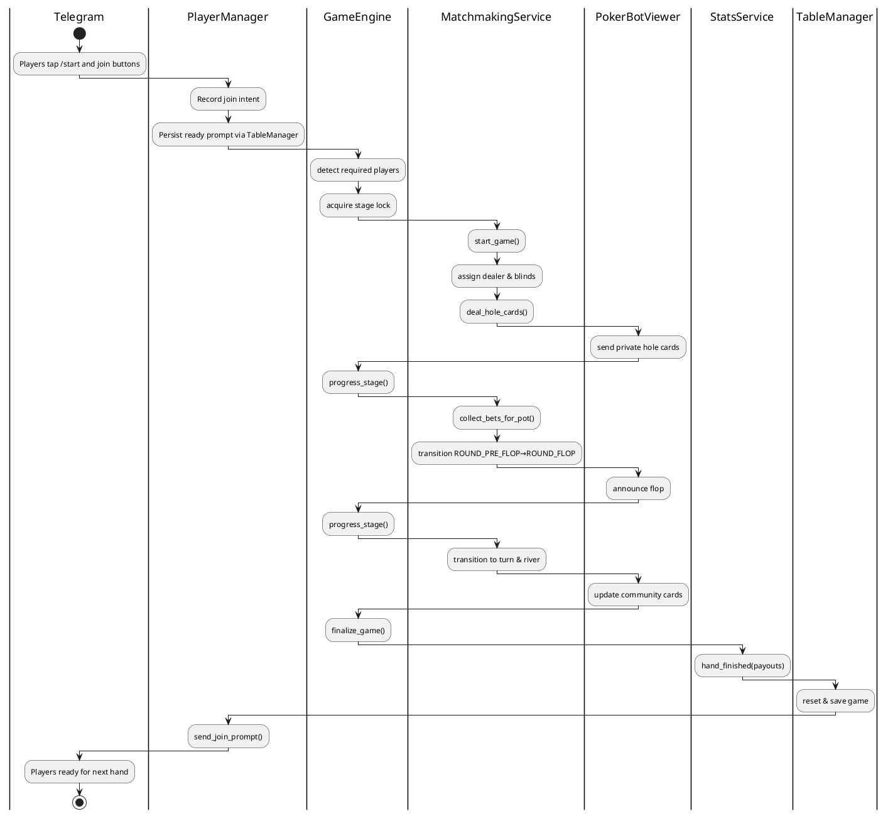

# PokerBot Game Flow

This document expands on the concise state machine reference at the top of
[`pokerapp/game_engine.py`](../pokerapp/game_engine.py). It links the public
coroutines that drive the table lifecycle with the collaborating services that
persist chat state, talk to Telegram, and record statistics. Hands always start
in `WAITING`, travel through the betting stages, and conclude when
`finalize_game()` resets the chat back to the lobby.

## State progression at a glance

The poker bot advances through well-defined `GameState` values. Hands start in
`WAITING` (players join) and finish when `finalize_game()` runs. The diagram
below shows the happy-path transition sequence alongside the coroutines that
move the state machine forward. Early exits (for example when everyone folds)
are also handled by `finalize_game()`. The Mermaid source lives in
[`docs/diagrams/game_flow_sequence.mmd`](diagrams/game_flow_sequence.mmd) so the
image can be regenerated without editing this narrative.

### State triggers, exits, and responsibilities

| Stage | Entry trigger | Exit conditions | Key responsibilities |
| ----- | ------------- | --------------- | ------------------- |
| `WAITING` | `finalize_game()` completes or a brand-new chat initializes a persisted `Game` record. `PlayerManager.send_join_prompt` keeps the lobby visible. | `MatchmakingService.start_game` is invoked after a `/start` request and enough ready seats exist. | Accept join requests, persist the waiting game via `TableManager`, broadcast countdown updates. |
| `ROUND_PRE_FLOP` | `GameEngine.start_game` acquires the stage lock, rotates blinds, and delegates to `MatchmakingService.start_game`. | All active players act (call/raise/fold) and the betting cycle resolves, or every contender but one folds. In both cases `progress_stage` returns control. | Assign dealer/blind roles, post blinds, deal hole cards, trigger `RequestMetrics.start_cycle`, persist the updated `Game` snapshot. |
| `ROUND_FLOP` | `progress_stage` advances from pre-flop and burns + deals three community cards under the stage lock. | Betting cycle completes with at least two contenders, or the table short-circuits to `finalize_game()` when only one player remains. | Reset `has_acted`, publish flop snapshots via `PokerBotViewer`, save state through `TableManager`. |
| `ROUND_TURN` | Triggered by `progress_stage` immediately after the flop round resolves. | Stage betting resolves with multiple contenders, or the hand ends early because everyone but one folded/timed out. | Deal the turn card, refresh betting order, keep telemetry/logging via `RequestMetrics`. |
| `ROUND_RIVER` | Reached when turn betting finalises while at least two active players remain. | Betting cycle completes; if more than one contender survives, `progress_stage` calls `finalize_game()` for showdown, otherwise the single remaining player wins immediately. | Deal the river card, instruct the viewer to render the full board, persist the final betting state. |
| `finalize_game()` | Called from `progress_stage`, `request_stop`, or timeout/error handlers whenever a hand needs to settle. | `GameEngine._reset_game_state` saves the `WAITING` state and `PlayerManager.send_join_prompt` re-opens the lobby. | Determine winners, distribute payouts, emit statistics, invalidate caches, clean up Telegram anchors, and reset timers/locks. |

`MatchmakingService.progress_stage` enforces stage order while holding the
`LockManager` stage lock so that Telegram callbacks, background jobs, and rate
limited retries cannot interleave inconsistent mutations. If at any point only
one player remains (everyone else folded or timed out) the engine short-circuits
to `finalize_game()` even if community cards are still undealt.

## Transition rules and safeguards

- **Waiting for quorum** — `PlayerManager` triggers the first transition only
  when the lobby has at least the configured minimum number of ready players and
  blinds can be assigned. Duplicate `/start` requests are coalesced behind the
  stage lock.
- **Betting cycles** — Each stage waits for every non-folded player to either
  match the highest wager, raise, or fold. The lock ensures callbacks such as
  `fold` or `all-in` are processed sequentially.
- **Community card dealing** — `MatchmakingService.add_cards_to_table` is only
  invoked while holding the stage lock, guaranteeing that snapshots published by
  `PokerBotViewer` match the persisted `Game` state.
- **Finalisation** — `GameEngine.finalize_game()` is responsible for both normal
  showdowns and early finishes. It computes winners, writes statistics, and
  resets the chat back to `WAITING`.

## Swimlane — collaborating components

The following swimlane diagram captures how the main services collaborate during
one full hand. Each lane highlights the responsibilities that the class owns or
delegates.

The PlantUML source for the swimlane diagram is stored at
[`docs/diagrams/game_flow_swimlane.puml`](diagrams/game_flow_swimlane.puml).

## Supporting services referenced

- **TableManager** keeps one `Game` object per chat persisted to Redis so that
  reconnections and bot restarts recover ongoing hands.
- **PlayerManager** renders the join prompt, manages seat assignments, and keeps
  localized role labels (dealer, small blind, big blind) up to date.
- **PokerBotViewer** is the façade around the messaging layer. It batches edits
  and renders translated templates for table messages and anchors.
- **StatsService** (via `StatsReporter`) records per-hand statistics and drives
  bonus eligibility caches using `AdaptivePlayerReportCache`.
- **RequestMetrics** records timing and outcome metadata for each major player
  interaction so incidents can be diagnosed.

Together these components allow the state machine to remain small and
cohesively focused on poker rules while infra concerns (persistence, retries,
metrics, localization) remain testable in isolation.
