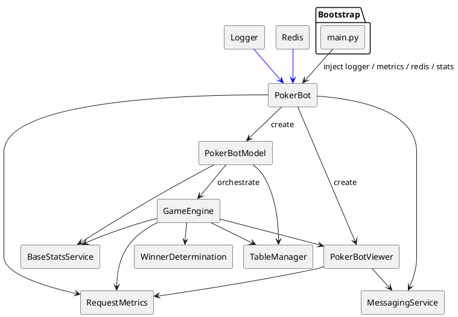
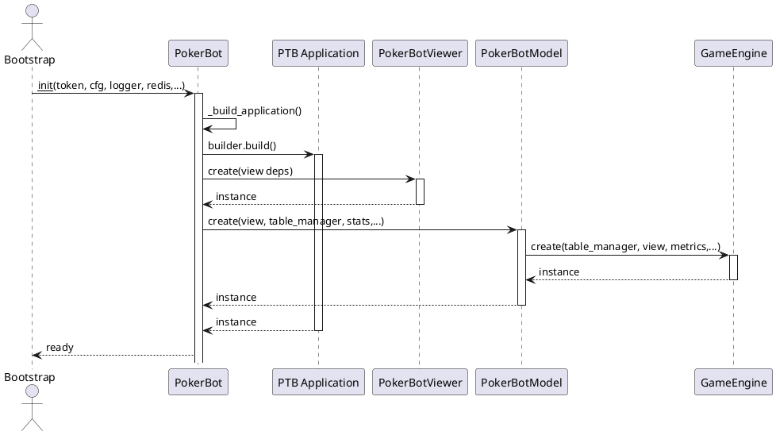
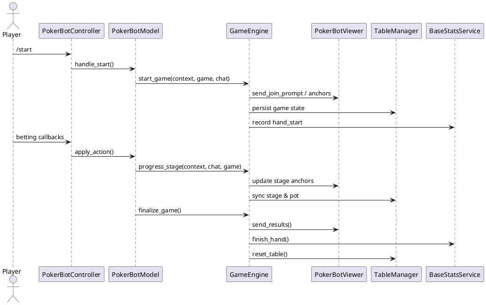
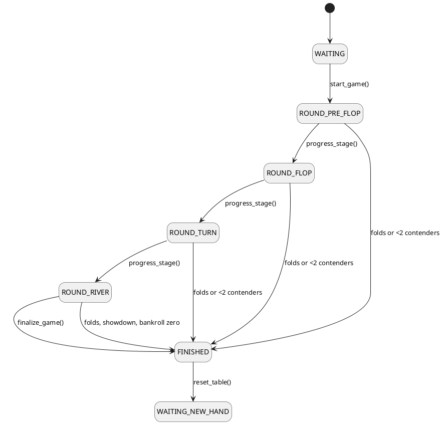

# PokerBot Game Flow & Architecture

This guide documents the current decoupled architecture of the Poker Telegram Bot.
It cross-references the runtime entry points, lifecycle methods, and supporting
services that collaborate to run a single hand of Texas Hold'em. The goal is to
explain how infrastructure dependencies are injected, how the game progresses
through its stages, and how presentation updates reach Telegram clients.

The documentation is intentionally grounded in the production implementation:

- [`pokerapp/pokerbot.py`](../pokerapp/pokerbot.py) hosts the Telegram
  orchestration (`run_webhook`, `run_polling`, `_build_application`).
- [`pokerapp/pokerbotview.py`](../pokerapp/pokerbotview.py) renders inline
  keyboards and manages anchor caches for efficient message edits.
- [`pokerapp/game_engine.py`](../pokerapp/game_engine.py) encapsulates the state
  machine (`start_game`, `progress_stage`, `finalize_game`).
- [`README.md`](../README.md) captures player-facing rules and the daily bonus
  table that contextualise the stages below.

## Architecture Modules & Roles

| Module | Responsibility | Injected Collaborators |
| ------ | --------------- | ---------------------- |
| `PokerBot` | Builds the `Application` object and wires controllers, handlers, and job queue. | `logging.Logger`, `RequestMetrics`, `RedisSafeOps`, Redis connection (`kv_async`), `TableManager`, `BaseStatsService`, `PrivateMatchService`, `MessagingServiceFactory`. |
| `PokerBotModel` | Business rules bridging Telegram updates and the game engine. | `PokerBotViewer`, `TableManager`, `BaseStatsService`, Redis (`kv`), `Config`. |
| `PokerBotViewer` | Presentation layer for players and spectators (inline keyboards, card renders, throttled edits). | `RequestMetrics`, `MessagingService`, Telegram `Bot`. |
| `GameEngine` | Game state machine, table orchestration, persistence, and statistics updates. | `TableManager`, `PokerBotViewer`, `WinnerDetermination`, `RequestMetrics`, `BaseStatsService`, `LockManager`, logger. |
| Supporting Services | Infra dependencies created during bootstrap. | Redis (`kv_async`), Postgres-backed `StatsService`, metrics collectors, messaging adapters. |

The bootstrap script (`main.py`) remains responsible for configuring logging,
instantiating Redis, stats, and metrics clients, and injecting them into the
`PokerBot` constructor. All runtime objects now share these singletons rather
than creating ad-hoc connections internally.

## High-Level Architecture Diagram

```
                  ┌───────────────────────────────┐
                  │        main.py / bootstrap    │
                  │  • load Config & logging      │
                  │  • build Redis / metrics      │
                  │  • construct StatsService     │
                  │  • instantiate PokerBot      │
                  └──────────────┬────────────────┘
                                 │  injected deps
                                 ▼
                   ┌───────────────────────────────┐
                   │           PokerBot            │
                   │  • PTB Application builder    │
                   │  • run_webhook / run_polling  │
                   │  • controller wiring          │
                   └──────┬───────────────┬────────┘
                          │               │
                          ▼               ▼
               ┌────────────────┐   ┌────────────────┐
               │ PokerBotModel  │   │ PokerBotViewer │
               │ • state & DI   │   │ • UI rendering │
               │ • GameEngine   │   │ • anchor cache │
               └──────┬─────────┘   └────────┬───────┘
                      │                      │
                      ▼                      │
               ┌────────────────┐            │
               │  GameEngine    │◄───────────┘
               │ • game states  │
               │ • TableManager │
               │ • StatsService │
               │ • metrics/logs │
               └────────────────┘
```

### PlantUML (architecture)



## Sequence Diagram — Bot Startup & Dependency Injection

The following diagram traces control as bootstrap code builds the Telegram
Application and wires the decoupled services.

```
main.py            PokerBot           PTB Application        PokerBotViewer   PokerBotModel   GameEngine
   |                  |                      |                     |               |              |
   | configure cfg    |                      |                     |               |              |
   | build logger     |                      |                     |               |              |
   | build redis ---->| __init__             |                     |               |              |
   | build stats ---->|  _build_application  |                     |               |              |
   | build metrics -->|--------------------->| builder             |               |              |
   |                  |  create viewer --------------------------->|               |              |
   |                  |  create model ------------------------------------------->| injects      |
   |                  |  wire controller     |                     |               |              |
   |                  |  add handlers       |                     |               |              |
   |                  |  return Application |                     |               |              |
   |                  | ready to run        |                     |               |              |
```

### PlantUML (startup sequence)



## Sequence Diagram — Game Start → Stage Progression → Finalization

This flow describes what happens after players tap `/start` and the bot begins a
hand.

```
Player/Telegram   PokerBotController   PokerBotModel        GameEngine           PokerBotViewer     TableManager   StatsService
       |                |                    |                   |                     |                 |              |
       | /start command |                    |                   |                     |                 |              |
       |--------------->| handle_start       |                   |                     |                 |              |
       |                |------------------->| start_game_async  |                   |                     |              |
       |                |                    |------------------>| start_game         | send anchors ---->| persist      | hand_start
       |                |                    |                   | deal blinds/cards  | update board      |              |
       | bet actions    |                    | progress_stage    |------------------->| stage change      | update state |
       |----------------|------------------->|------------------>| collect bets       | refresh anchors   | store pot    |
       |                |                    |                   | advance GameState  | notify players    |              |
       | showdown       |                    | finalize_game     |------------------->| final summary     | reset table  | record stats
       |                |                    |                   | determine winners  | post winners      | cleanup      | finish_hand
```

### PlantUML (game lifecycle)



## Poker Game State Machine

`GameEngine.ACTIVE_GAME_STATES` and `_progress_stage_locked` control the allowed
transitions. The ASCII state diagram below matches the actual implementation,
including early termination rules.

```
┌────────┐
│WAITING │  (lobby / gathering players)
└──┬─────┘
   │ start_game()
   ▼
┌─────────────────┐
│ROUND_PRE_FLOP   │ --deal hole cards--> assigns blinds, sets current player
└──────┬──────────┘
       │ progress_stage()
       ▼
┌─────────────────┐    ┌────────────────┐    ┌────────────────┐
│ROUND_FLOP       │ -> │ROUND_TURN      │ -> │ROUND_RIVER     │
└──────┬──────────┘    └──────┬─────────┘    └──────┬─────────┘
       │ add community cards         │ add final card      │ showdown
       ▼                             ▼                    ▼
┌─────────────────┐
│FINISHED         │ <- finalize_game() updates stats, payouts, summaries
└──────┬──────────┘
       │ reset_table()
       ▼
┌─────────────────┐
│WAITING_NEW_HAND │ (anchors cleared, ready for next /start)
└─────────────────┘
```

### PlantUML (state machine)



## Dependency Injection & Instrumentation

- **Logger** — Propagated from bootstrap to `PokerBot` and further into
  `GameEngine` for diagnostic events (stage transitions, retry warnings).
- **Redis / TableManager** — `PokerBotModel` and `GameEngine` use the shared
  Redis pool for persisting tables, stage locks, and ready messages. Safe
  operations flow through `RedisSafeOps` to centralise retry policies.
- **RequestMetrics** — Counted in `PokerBotViewer` (Telegram API throughput) and
  `GameEngine` (stage progression, join prompts) for operational dashboards.
- **StatsService** — Called during `start_game` (identity caching) and
  `finalize_game` (`finish_hand`, payouts) to track leaderboard data.
- **MessagingService** — Created by `PokerBot` and consumed by `PokerBotViewer`
  to abstract over send/edit/delete operations with automatic retries.

## In-Code Cross References

New inline documentation points back to this guide:

- `PokerBot` class docstring summarises dependency injection and links here.
- `GameEngine` module docstring contains the ASCII state machine.
- `PokerBotViewer` module docstring references the architecture and UI sections.
- Inline comments inside `_build_application` describe how the Application wires
  the view and model.

Consult these markers to jump between code and documentation when extending the
bot or preparing tests.
