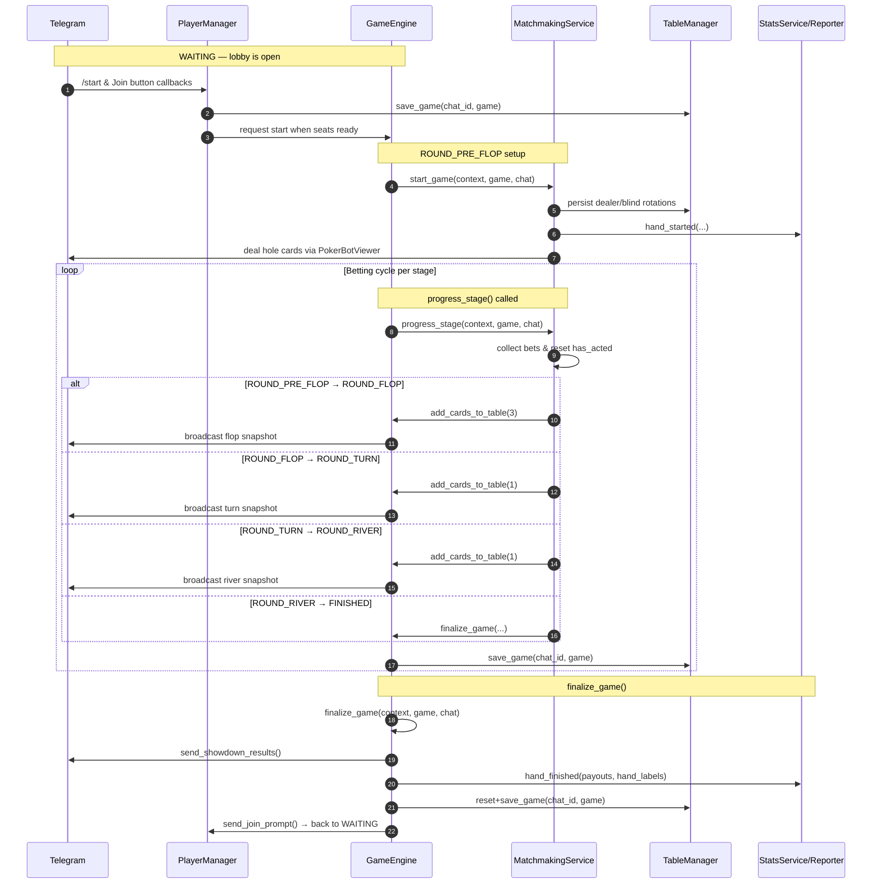
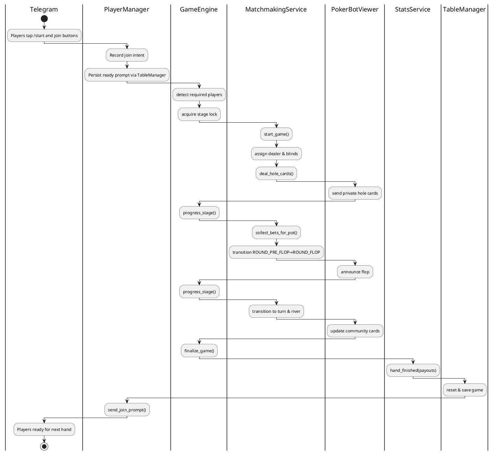

# PokerBot Game Flow

This document expands on the concise state machine reference at the top of
[`pokerapp/game_engine.py`](../pokerapp/game_engine.py). It links the public
coroutines that drive the table lifecycle with the collaborating services that
persist chat state, talk to Telegram, and record statistics.

## State progression at a glance

The poker bot advances through well-defined `GameState` values. Hands start in
`WAITING` (players join) and finish when `finalize_game` runs. The diagram below
shows the happy-path transition sequence alongside the coroutines that move the
state machine forward. Early exits (for example when everyone folds) are also
handled by `finalize_game`.

### Stage specific responsibilities

| Stage | Trigger | Key responsibilities |
| ----- | ------- | ------------------- |
| `WAITING` | Player reactions (`/start`, inline joins) | `PlayerManager.send_join_prompt` displays the CTA. `TableManager` keeps the pending game persisted so reconnections resume correctly. |
| `ROUND_PRE_FLOP` | `MatchmakingService.start_game` | Dealer button rotation, blind posting, hole-card dealing, statistics start hooks, `RequestMetrics.start_cycle`. |
| `ROUND_FLOP` | `GameEngine.progress_stage` → `MatchmakingService.progress_stage` | Burn + deal three community cards, reset `has_acted` flags, notify viewers, persist table snapshot. |
| `ROUND_TURN` | Subsequent `progress_stage` call | Deal the fourth card, refresh betting order, persist state. |
| `ROUND_RIVER` | Subsequent `progress_stage` call | Deal the final card, determine if betting continues or hand can be settled immediately. |
| `FINISHED` | `GameEngine.finalize_game` | Evaluate hands, distribute pot, emit statistics, clear anchors, prompt new hand. |

`MatchmakingService.progress_stage` enforces stage order while holding the
`LockManager` stage lock so that Telegram callbacks, background jobs, and rate
limited retries cannot interleave inconsistent mutations.

## Swimlane — collaborating components

The following swimlane diagram captures how the main services collaborate during
one full hand. Each lane highlights the responsibilities that the class owns or
delegates.

## Supporting services referenced

- **TableManager** keeps one `Game` object per chat persisted to Redis so that
  reconnections and bot restarts recover ongoing hands.
- **PlayerManager** renders the join prompt, manages seat assignments, and keeps
  localized role labels (dealer, small blind, big blind) up to date.
- **PokerBotViewer** is the façade around the messaging layer. It batches edits
  and renders translated templates for table messages and anchors.
- **StatsService** (via `StatsReporter`) records per-hand statistics and drives
  bonus eligibility caches using `AdaptivePlayerReportCache`.
- **RequestMetrics** records timing and outcome metadata for each major player
  interaction so incidents can be diagnosed.

Together these components allow the state machine to remain small and
cohesively focused on poker rules while infra concerns (persistence, retries,
metrics, localization) remain testable in isolation.
