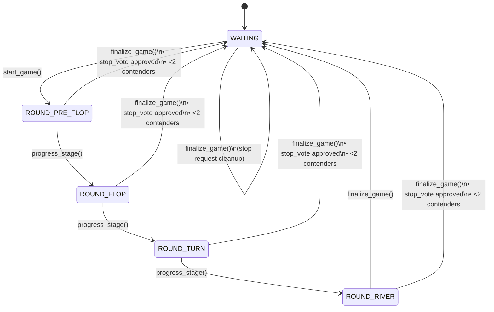

# PokerBot Game Flow

This guide expands the lightweight state-machine summary found at the top of
[`pokerapp/game_engine.py`](../pokerapp/game_engine.py). It explains how a poker
hand progresses, which coroutine triggers move the table between stages, and how
the supporting services keep Redis, Telegram, and analytics in sync.

## State machine

* `start_game()` is invoked by the model once the lobby has enough seated
  players. It transitions the persisted `Game` record from `WAITING` into
  `ROUND_PRE_FLOP` after blinds are posted and hole cards are dealt.
* `progress_stage()` advances the game through the betting streets while holding
  the stage lock. It calls into `MatchmakingService.progress_stage`, which either
  hands control back for the next betting cycle or triggers `finalize_game()`
  when the river is complete or an early exit condition is met.
* `finalize_game()` resets the chat to `WAITING`, posts results, and re-primes
  the lobby for the next hand.

### Locking & cache lifecycle by stage

| Stage | How we get here | LockManager role | Cache invalidations |
| ----- | --------------- | ---------------- | ------------------- |
| `WAITING` | `finalize_game()` or a brand-new chat creates a waiting `Game`. | The stage lock is idle; only table-level locks protect joins and seat assignments. | None; caches stay warm so `/stats` requests remain fast between hands. |
| `ROUND_PRE_FLOP` | `start_game()` acquires the stage lock and rotates dealer/blinds before cards are dealt. | LockManager guards the stage while the matchmaking service posts blinds, deals hole cards, and broadcasts turns to avoid interleaved Telegram callbacks. | No invalidation yet; analytics rely on pre-hand data to track participation. |
| `ROUND_FLOP` | `progress_stage()` collects bets, burns/deals three community cards, and re-schedules turns. | Stage lock stays held during dealing and viewer updates to ensure Redis snapshots and Telegram keyboards stay in sync. | None. |
| `ROUND_TURN` | Triggered by another `progress_stage()` call once flop betting resolves. | Stage lock serialises the single-card deal, bet resets, and viewer snapshot updates. | None. |
| `ROUND_RIVER` | Entered when the turn round finishes with ≥2 contenders. | LockManager continues to guard the stage while the final community card is revealed and players are prompted. | None. |
| `WAITING` (post-hand) | `finalize_game()` or `_reset_game_state_after_stop()` completes. | The stage lock is released; timers for the auto-start countdown can resume. | `AdaptivePlayerReportCache.invalidate_on_event(..., "hand_finished")` and `StatsReporter.invalidate_players(..., "hand_finished")` ensure next-stat requests rebuild from the latest results. |

### Early exits

* **Stop votes** — Active players (or the table manager) can request a stop via
  `/stop`. When a majority confirms, `cancel_hand()` refunds wallets, invalidates
  caches as if a hand finished, and immediately resets the state to `WAITING`
  without revealing additional cards.
* **Fewer than two contenders** — `MatchmakingService.progress_stage()` checks the
  active/all-in roster before every transition. If only one contender remains,
  it bypasses additional dealing, calls `finalize_game()`, and declares the
  remaining player the winner.
* **Stage anomalies** — If dealing fails (for example due to depleted decks) or
  a timeout leaves no active players, the service also escalates to
  `finalize_game()` so the next hand starts from a clean slate.

### Responsibilities per transition

1. **`start_game()`**
   - Cleans up any lingering join prompts.
   - Rotates dealer/blind positions and posts forced bets.
   - Deals hole cards while the stage lock prevents overlapping callbacks.
   - Signals `StatsReporter.hand_started` so lifetime statistics reflect the new
     hand.
2. **`progress_stage()`**
   - Collects wagers into the pot, resets `has_acted`, and advances to the next
     state if enough contenders remain.
   - Deals community cards using `MatchmakingService.add_cards_to_table`, which
     itself runs under the stage lock.
   - Persists the `Game` snapshot through `TableManager` so reconnecting players
     receive the updated board.
3. **`finalize_game()`**
   - Computes winners (including side pots) and distributes payouts.
   - Invalidates player-report caches and statistics, ensuring the next
     `/stats` lookup renders fresh data.
   - Clears pinned anchors and prompts the lobby so `WAITING` restarts with
     accurate seating information.

With these safeguards the poker flow remains deterministic even when Telegram
callbacks arrive concurrently or administrators stop a hand mid-round.
