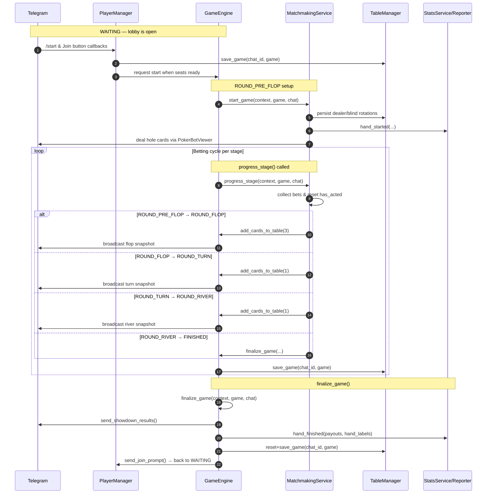
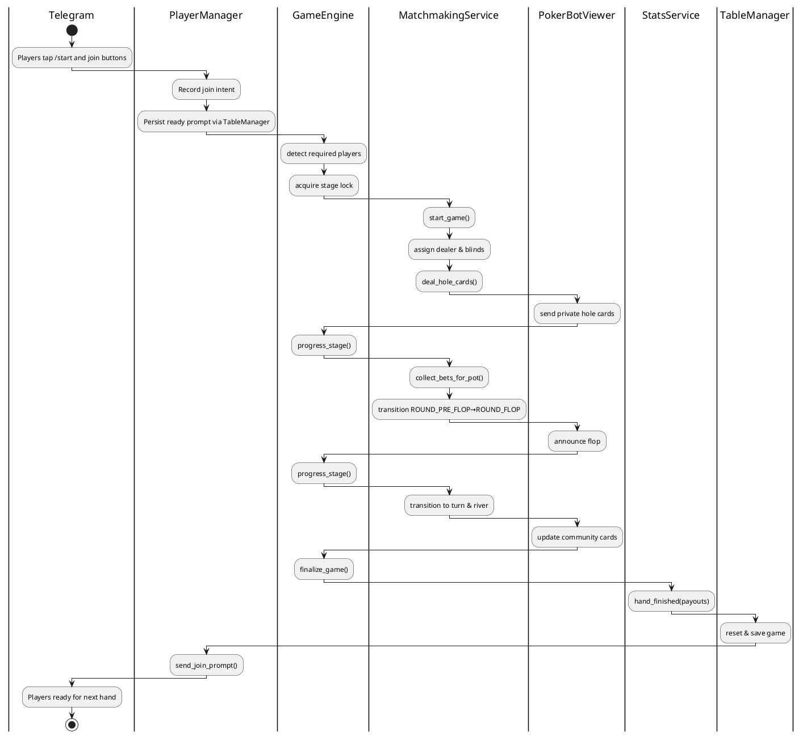

# PokerBot Game Flow

This document expands on the concise state machine reference at the top of
[`pokerapp/game_engine.py`](../pokerapp/game_engine.py). It links the public
coroutines that drive the table lifecycle with the collaborating services that
persist chat state, talk to Telegram, and record statistics.

## State progression at a glance

The poker bot advances through well-defined `GameState` values. Hands start in
`WAITING` (players join) and finish when `finalize_game` runs. The diagram below
shows the happy-path transition sequence alongside the coroutines that move the
state machine forward. Early exits (for example when everyone folds) are also
handled by `finalize_game`. The Mermaid source lives in
[`docs/diagrams/game_flow_sequence.mmd`](diagrams/game_flow_sequence.mmd) so the
image can be regenerated without editing this narrative.

### Stage specific responsibilities

| Stage | Transition | Trigger & conditions | Key responsibilities |
| ----- | ---------- | ------------------- | ------------------- |
| `WAITING` | → `ROUND_PRE_FLOP` | `PlayerManager` has enough ready players to satisfy `MIN_PLAYERS` and a `/start` request is processed. | `PlayerManager.send_join_prompt` displays the CTA. `TableManager` keeps the pending game persisted so reconnections resume correctly. |
| `ROUND_PRE_FLOP` | → `ROUND_FLOP` | `GameEngine.progress_stage` delegates to `MatchmakingService.progress_stage` once blinds are posted and the betting cycle completes without everyone folding. | Dealer button rotation, blind posting, hole-card dealing, statistics start hooks, `RequestMetrics.start_cycle`. |
| `ROUND_FLOP` | → `ROUND_TURN` | The flop betting round resolves (all active players have matched the highest bet or folded). | Burn + deal three community cards, reset `has_acted` flags, notify viewers, persist table snapshot. |
| `ROUND_TURN` | → `ROUND_RIVER` | Turn betting cycle completes under the stage lock. | Deal the fourth card, refresh betting order, persist state. |
| `ROUND_RIVER` | → `FINISHED` | River betting completes or only one player remains. | Deal the final card, determine if betting continues or hand can be settled immediately. |
| `FINISHED` | → `WAITING` | `GameEngine.finalize_game` has distributed the pot and sent results. | Evaluate hands, distribute pot, emit statistics, clear anchors, prompt new hand. |

`MatchmakingService.progress_stage` enforces stage order while holding the
`LockManager` stage lock so that Telegram callbacks, background jobs, and rate
limited retries cannot interleave inconsistent mutations. If at any point only
one player remains (everyone else folded or timed out) the engine short-circuits
to `finalize_game` even if community cards are still undealt.

## Transition rules and safeguards

- **Waiting for quorum** — `PlayerManager` triggers the first transition only
  when the lobby has at least the configured minimum number of ready players and
  blinds can be assigned. Duplicate `/start` requests are coalesced behind the
  stage lock.
- **Betting cycles** — Each stage waits for every non-folded player to either
  match the highest wager, raise, or fold. The lock ensures callbacks such as
  `fold` or `all-in` are processed sequentially.
- **Community card dealing** — `MatchmakingService.add_cards_to_table` is only
  invoked while holding the stage lock, guaranteeing that snapshots published by
  `PokerBotViewer` match the persisted `Game` state.
- **Finalisation** — `GameEngine.finalize_game` is responsible for both normal
  showdowns and early finishes. It computes winners, writes statistics, and
  resets the chat back to `WAITING`.

## Swimlane — collaborating components

The following swimlane diagram captures how the main services collaborate during
one full hand. Each lane highlights the responsibilities that the class owns or
delegates.

The PlantUML source for the swimlane diagram is stored at
[`docs/diagrams/game_flow_swimlane.puml`](diagrams/game_flow_swimlane.puml).

## Supporting services referenced

- **TableManager** keeps one `Game` object per chat persisted to Redis so that
  reconnections and bot restarts recover ongoing hands.
- **PlayerManager** renders the join prompt, manages seat assignments, and keeps
  localized role labels (dealer, small blind, big blind) up to date.
- **PokerBotViewer** is the façade around the messaging layer. It batches edits
  and renders translated templates for table messages and anchors.
- **StatsService** (via `StatsReporter`) records per-hand statistics and drives
  bonus eligibility caches using `AdaptivePlayerReportCache`.
- **RequestMetrics** records timing and outcome metadata for each major player
  interaction so incidents can be diagnosed.

Together these components allow the state machine to remain small and
cohesively focused on poker rules while infra concerns (persistence, retries,
metrics, localization) remain testable in isolation.
